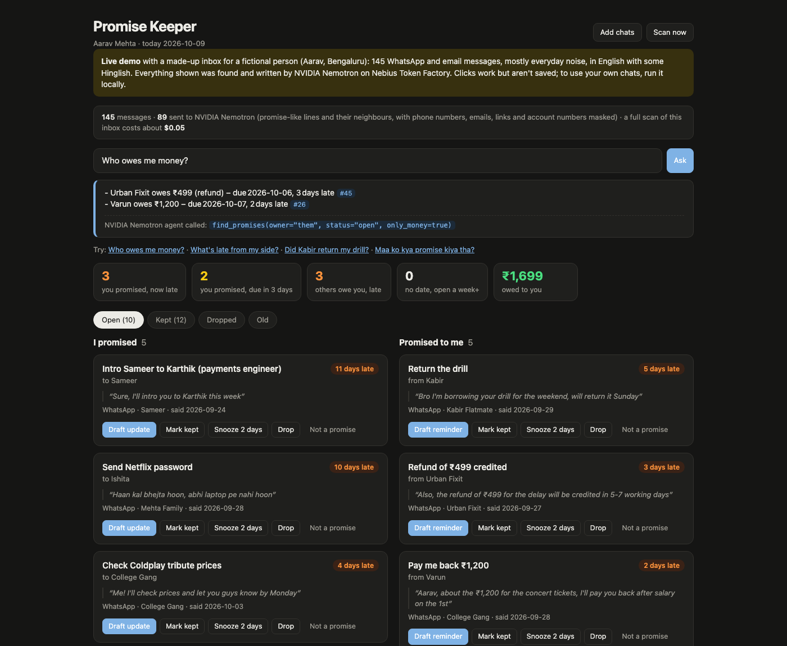
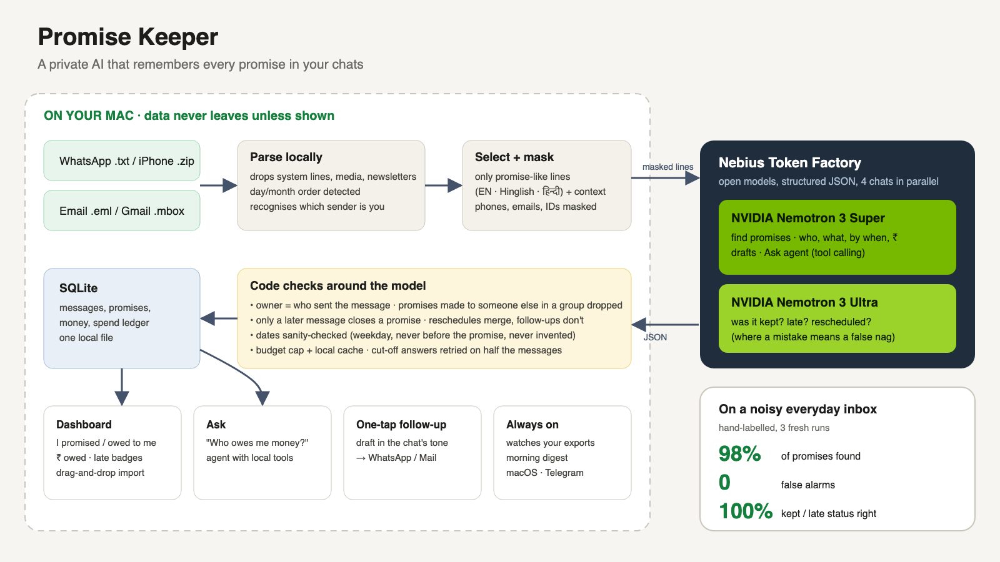

# Promise Keeper

A private AI that remembers every promise in your chats, so you don't have to.

"Kal tak bhej dunga." "I'll send the floor plan by EOD tomorrow." "Plumber Tuesday tak aa jayega."
We make and receive dozens of small promises a week across WhatsApp and email, mixed in with hundreds of
forwards, memes and "haha"s. Promise Keeper reads your chat and email exports on your own machine, picks out
the real promises in both directions, notices when they're kept, and tells you what's late before it becomes
awkward. For anything late, it drafts the follow-up in the tone of that conversation.

**[Try the live demo](https://twinklekhosla.github.io/promise-keeper/demo/)** (a made-up inbox, no sign-up;
[ask it who owes you money](https://twinklekhosla.github.io/promise-keeper/demo/#ask=Who%20owes%20me%20money%3F))



## What it does

- **Finds real promises in everyday chat noise**, in English, Hindi (including Devanagari) and Hinglish:
  "deck kal tak bhej dunga" becomes *Send the deck, due tomorrow*. It ignores the rest: forwards, jokes
  ("I'll kill you 😂"), maybes ("try karta hoon"), RSVPs ("I'm in"), promises to yourself ("gym from
  Monday"), marketing, and promises between other people in your groups.
- **Works out due dates**: "by Monday", "EOD tomorrow", "5-7 working days", "this Saturday" from earlier in
  the chat. Code checks catch the model's date slips (a weekday that doesn't match, a date before the
  promise was made, a date made up when none was said).
- **Follows the conversation.** "Here's the deck" marks it kept. "Sorry ji, Monday pakka" moves the date
  instead of creating a duplicate. "Done, I'll handle it" is not proof it happened. A second visit after
  the first was completed is a new promise.
- **Both sides, and money:** what you owe people and what people owe you, with amounts totalled
  ("₹1,699 owed to you").
- **Ask it anything:** "Who owes me money?", "Did Kabir return my drill?", "Maa ko kya promise kiya tha?".
  A Nemotron agent answers with tool calls against your local promise list and chats, citing each promise.
- **One-tap follow-up:** a draft in the chat's own language and tone (Hinglish with friends, formal for a
  contractor, never inventing reasons), opened straight in WhatsApp or as a reply in your mail app.
- **Daily digest** as a macOS notification or Telegram message.
- **Knows what matters.** Each promise is weighted: money, documents, bookings and anything for a third
  person are high; tiny household logistics ("make kebabs", "come around 7:30") are hidden as minor and never
  nag, one click away if you want them. A code check guarantees that sending, returning, paying, booking or
  introducing is never hidden, whatever the model says.
- **Learns what you don't care about.** "Not a promise" hides an item and shows it to the model as an
  example to skip next time. Items that go quiet for 30 days retire to an "Old" tab instead of nagging.

## Everyday use

1. `python -m promise_keeper serve` and open http://127.0.0.1:8765
2. **Live, with WhatsApp for Mac:** install it, link your phone once, click **WhatsApp live** and tick the chats
   that matter. New messages in those chats show up within seconds and are scanned automatically (at most one
   scan every 10 seconds, so a burst of messages costs one scan). Each sync reads only the rows added since the
   last one, and the page refreshes the moment something changes, so what you see is never stale. Only the
   ticked chats are ever read, and WhatsApp's database is opened read-only.
   **Or with exports:** in WhatsApp, **Export chat → Without media** and drag the files onto the page: Android
   `.txt`, iPhone `.zip` (no need to unzip), or email `.eml` / Gmail Takeout `.mbox`.
3. That's it. It recognises which sender is you from your one-to-one chats (and your email address from your
   mailbox), scans in the background with live progress, and shows what's late.

To keep it running without the dashboard:

```bash
python -m promise_keeper install ~/Downloads     # writes a macOS login item; prints the one command to turn it on
```

It follows your picked WhatsApp chats every minute, re-reads only export files that changed (the folder is
optional), finds new promises, and sends the digest every morning at 9.

## Private by design

- Live WhatsApp sync reads only the chats you tick, from WhatsApp for Mac's own database on this machine,
  opened read-only. The picker reads chat names only.
- Exports and the database stay on your machine (`data/`, one SQLite file). The dashboard only listens on
  `127.0.0.1`.
- Only promise-like messages and requests are sent to the model, each with just enough context: the message
  it replies to, the replies after a request, and the nearest earlier mention of a day or date. Everything
  else never leaves the machine. Newsletters and marketing email (list headers) are skipped entirely.
- Phone numbers, emails, links and long numbers (account, policy, OTP) are masked locally before sending,
  including senders who appear as phone numbers in group exports, and restored locally in the answers.
- The dashboard shows how many messages have been sent.
- Open models only: NVIDIA Nemotron 3 Super finds promises and writes drafts; NVIDIA Nemotron 3 Ultra decides
  whether a promise was kept (the step where a mistake means a wrong "3 days late" nag).
- Hard spending cap: every call's cost is logged, and the app refuses to call the model once the total
  reaches `PK_BUDGET_USD` (default $3). Identical requests are answered from a local cache for free.

## How it works



```
WhatsApp .txt / iPhone .zip ─┐
.eml / .mbox email ──────────┴─► parse locally (system lines, edits, media, bulk mail dropped;
                                  day/month order detected; you detected) ─► SQLite
                                        │
                  promise-like phrase or request? (English, Hinglish, Devanagari cues)
                                        │ yes, plus minimal context
                            mask contact details locally
                                        ▼
                        NVIDIA Nemotron on Nebius Token Factory
                  1. extract (Super): who promised what, to whom, by when
                  2. track (Ultra): later outcome-like messages → kept / dropped / moved
                  3. draft (Super): follow-up in the chat's own tone
                  4. ask (Super agent): tool calls to find_promises / money_summary / search_messages
                                        ▼
    code checks: owner = message sender; promises made to other people dropped; a promise closes only
    on a later message; reschedules merge, follow-ups stay separate; dates sanity-checked
                                        ▼
         dashboard (localhost) · daily digest (macOS / Telegram) · CLI · background watcher
```

Chats are scanned four at a time. A chat that fails (for example, an answer cut off by the model's length
limit, which is retried with half the messages first) is skipped and retried on the next scan; it never
stops the others.

## Accuracy

Two hand-labelled test inboxes ship with the repo, with `python -m promise_keeper eval`:

- **Everyday** (`bench/`): 146 messages across a family group, a college friends group, a flatmate, a side
  project, a repair service, an old friend, a memes chat and three emails. Mostly noise: forwards, banter,
  jokes, maybes, RSVPs, predictions, other people's promises, marketing. 20 real promises, plus 7 borderline
  ones ("will be there in 20", "I'll get milk on the way") that count neither way.
- **Demo** (`demo/`): 55 messages, 20 promises, denser, used for the walkthrough.

A third inbox, `showcase/`, is the everyday story in English with a few Hinglish lines; the live demo and the
video use it. It has no answer key.

Three fresh runs each (no cache):

| | Everyday | Demo |
|---|---|---|
| Promises found | 59/60 (98%) | 58/60 (97%) |
| Found items that are real promises | 59/59 (100%) | 58/59 (98%) |
| Due date right (±1 day) | 57/59 (97%) | 57/58 (98%) |
| Kept / open status right | 59/59 (100%) | 58/58 (100%) |
| Messages sent to the model | 65% | 89% |
| Cost per run | ~$0.05 | ~$0.05 |

These inboxes are dense on purpose, so most messages sit next to a promise; in real chats a far smaller share
is sent. The misses were borderline promises ("Forwarding to Kunal today") and one follow-up the model
treated as a reschedule. One later fix (never inventing a date from a weekday in a shared quote) came after
this measurement.

## Setup

Requires Python 3.10+ and a [Nebius Token Factory](https://tokenfactory.nebius.com) API key.

```bash
python3 -m venv .venv && source .venv/bin/activate
pip install -r requirements.txt
cp .env.example .env              # paste your Nebius API key into .env
python scripts/check_nebius.py    # one Nemotron call to confirm the key works
python -m pytest                  # unit tests, no network
```

## Try the demo

```bash
python -m promise_keeper demo --reset     # loads the demo inbox, finds and tracks promises, prints the digest
python -m promise_keeper eval             # scores it against demo/gold.json
python -m promise_keeper --demo serve     # dashboard at http://127.0.0.1:8765
python -m promise_keeper demo --dataset bench --reset && python -m promise_keeper eval --dataset bench
```

The demos pin "today" (2 and 9 October 2026) so late and upcoming items make sense.

## Command line

```bash
python -m promise_keeper estimate ~/Exports   # free dry run: how much would be sent, rough cost
python -m promise_keeper ingest ~/Exports     # WhatsApp .txt/.zip, .eml, .mbox, or folders of them
python -m promise_keeper whatsapp chats       # live sync: list chat names in WhatsApp for Mac
python -m promise_keeper whatsapp pick "Flat 4B" "Rohan Kapoor"   # follow these chats (only these are read)
python -m promise_keeper whatsapp sync        # read new messages from them now and scan
python -m promise_keeper scan                 # find new promises (last 60 days), check old ones
python -m promise_keeper digest --notify      # what's late or coming up
python -m promise_keeper list                 # everything
python -m promise_keeper draft 12             # follow-up message for promise #12
python -m promise_keeper ask "who owes me money?"
python -m promise_keeper spend                # model cost so far
python -m promise_keeper init --name "Your Name" --email you@example.com   # only if auto-detection guesses wrong
```

### Settings (`.env`)

| | Default | |
|---|---|---|
| `NEBIUS_API_KEY` | | required |
| `PK_BUDGET_USD` | `3.0` | hard cap on model spend |
| `PK_MODEL` | Nemotron 3 Super | finding promises and drafts |
| `PK_TRACK_MODEL` | Nemotron 3 Ultra | deciding kept / late |
| `PK_WHATSAPP_DB` | WhatsApp for Mac's database | point live sync elsewhere, e.g. the made-up one from `scripts/fake_whatsapp.py` |
| `PK_TELEGRAM_TOKEN`, `PK_TELEGRAM_CHAT_ID` | | digest to Telegram (bot from [@BotFather](https://t.me/BotFather); chat id from `https://api.telegram.org/bot<token>/getUpdates` after you message it) |

Rough running cost: about $0.0005 per message sent to the model, so well under $1 a month for typical personal
chat volume.

## Publishing the live demo

`python scripts/export_static.py` writes `docs/demo/index.html`: the dashboard as one static file on the
showcase inbox, with pre-written drafts and four example answers (clicks work, nothing is saved, no API key
needed). On GitHub, **Settings → Pages → Deploy from a branch → main, /docs**, and it's live at
`https://<you>.github.io/promise-keeper/demo/`.

## Project layout

```
promise_keeper/
  sources/        WhatsApp (.txt, iPhone .zip), live WhatsApp for Mac, and email readers; detecting who you are
  live.py         live sync loop: notices WhatsApp writes, reads the picked chats, triggers scans
  ingest.py       load messages into SQLite; skip unchanged files
  extract.py      pick promise-like lines + context; Nemotron extraction; code checks and merging
  track.py        kept / dropped / rescheduled from later messages
  nudge.py        digest, money totals, follow-up drafts, notifications
  ask.py          the Ask agent: Nemotron with local tools
  pipeline.py     the one routine: extract, track, retire quiet promises
  jobs.py, web.py, static/   dashboard with drag-and-drop import and background scans
  privacy.py      local masking
  llm.py          Nebius client with budget cap, cache, and cut-off detection
  evaluate.py     scoring against the answer keys
bench/, demo/     test inboxes and answer keys
scripts/fake_whatsapp.py   a made-up WhatsApp for Mac database, to try live sync without real chats
tests/            unit tests
```

## License

MIT, see [LICENSE](LICENSE).
